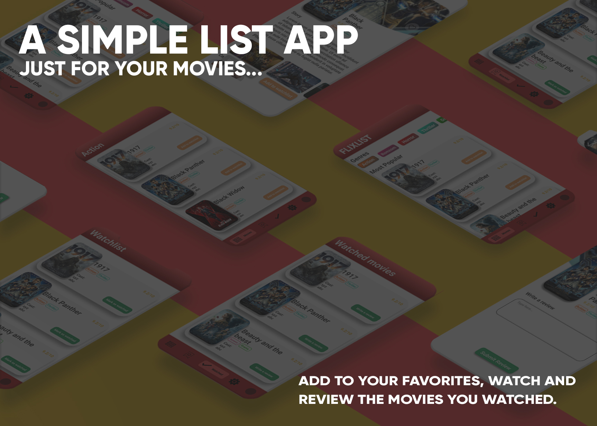

##App Name: FlixList

## Submitted by : ICONWizs

**Team Members:**

-- Sathvik Saaya, Flutter Genius  
-- Vishnu Anand, UI Designer

### IDEA or Problem Statement:

Our main app idea is for a user to maintain a "list" of movies that he/she has watched
or wants to watch and review those movies for other users to view.
We as developers maintain such a list on other apps like google keep, but we felt that
a lot of people maintain such "Watch lists" so we went ahead and made an app for that purpose.
This app is mainly to maintain lists of what one wants to watch or already has watched. App is
not meant for streaming.

Flutter and dart have been used to give life to the idea. Flutter gives us a more comfortable 
platform for front end development, so we have implemented everything on flutter.

### Softwares used: 
Figma, Visual Studio Code.

#### Design explaination:

--Theme
We wanted to make the user feel right at home with our app. So we used a Red shades as our primary colour. 
Based on the netflix philosophy of colour science, users can instantly relate the app to a cinema or a movie theater because of the red accents.

--Ease of use

- We have implemented a Nav bar which allows the user to seamlesly switch between the full list 
of suggested movies and the movies that the user had favorited. This nav bar was inspired from
instagram's UI design.

- We have placed strategic buttons on the cards that offer movie information so that the user has
a very easy access to place the movie in their favorites list or to even write a review.

- In the home screen, there is a small scrollable genre based buttons where the user can easily
jump to whatver genre the user is in the mood to watch.

- The home screen movie cards give most of the information that a user would need, like the
movie name, movie poster, it's genres and its IMDB rating. Moreover, on tap the card would lead 
to a detailed page where full information is provided along with the ratings of other users.

##APP Dev submission

Language/Framework used: Flutter and Dart.

-- YouTube Link :  
-- GitHub Link :
